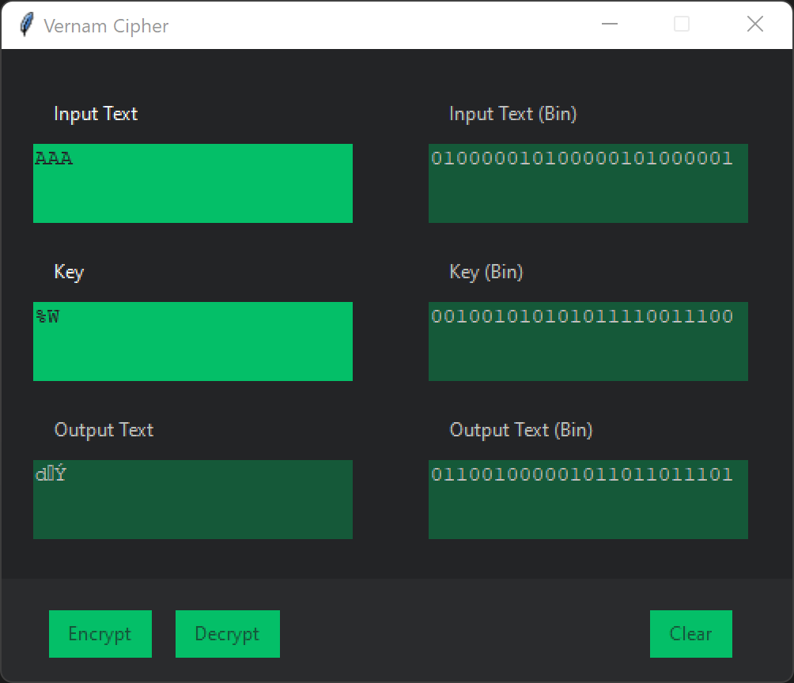
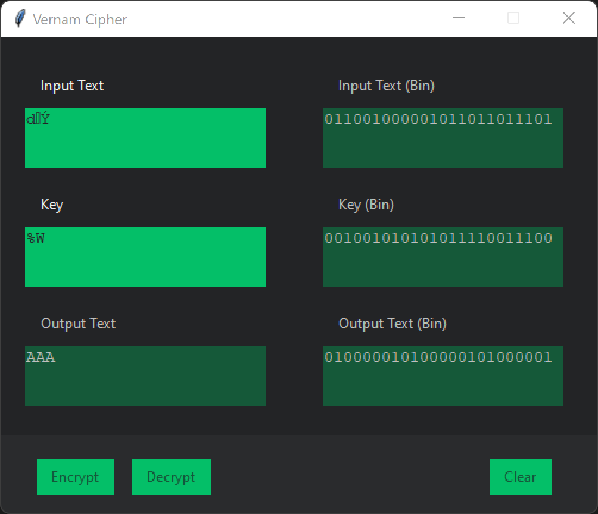

# Cifrado de Vernam

El cifrado de Vernam se basa en la sustitución polialfabetica mediante una clave generada de una forma aleatoria. Como la generación aleatoria sigue siendo, a dia de hoy, uno de los problemas informáticos que no hemos sido capaces de solventar, en este caso, se trata de una generación pseudoaleatoria basada en smillas.

El funcionamiento del cifrado se basa en la suma binaria entre el mensaje a cifrar y una cadena aleatoria binaria, obteniendo como salida la clave cifrada.

Este cifrado tiene secreto perfecto, es decir, teóricamente es irrompible. Sin embargo, para poder realizar el descifrado de la cadena necesitamos la clave original usada para cifrar el mensaje, con lo que no nos es realmente útil, ya que si fueremos capaces de transmitir la clave de forma segura, no necesitamos un cifrado, ya que podríamos simplemente transmitir el mensaje a través de dicho canal seguro.

## Utilización
```shell
python GUI.py
```

## Vista previa


<br\>

<br\>


## Contribuir
Las solicitudes de modificación son bienvenidas. Para los cambios importantes, por favor, abra una cuestión en primer lugar para discutir lo que le gustaría cambiar.

Por favor, asegúrese de actualizar las pruebas según corresponda.